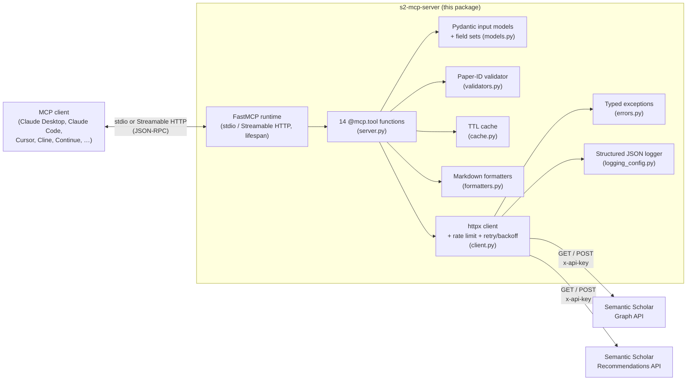

# Semantic Scholar MCP Server

<!-- mcp-name: io.github.smaniches/semantic-scholar-mcp -->

[](https://github.com/smaniches/semantic-scholar-mcp/actions/workflows/ci.yml)
[](https://codecov.io/gh/smaniches/semantic-scholar-mcp)
[](https://pypi.org/project/s2-mcp-server/)
[](https://doi.org/10.5281/zenodo.19324159)
[](#provenance--supply-chain)
[](https://ghcr.io/smaniches/semantic-scholar-mcp)
[](https://github.com/smaniches/semantic-scholar-mcp/releases)
[](https://opensource.org/licenses/MIT)
[](https://modelcontextprotocol.io)
[](https://www.python.org/downloads/)

**A 14-tool Semantic Scholar MCP server for academic research workflows.** Direct access to 200M+ papers from [Semantic Scholar](https://www.semanticscholar.org/) — paper search, citation graph traversal, author profiles, and recommendations — from any [Model Context Protocol](https://modelcontextprotocol.io) client (e.g., Claude Desktop, Claude Code, Cursor, Cline, Continue, and others).

Every release ships **verifiable supply-chain provenance**: Sigstore-signed SLSA build-provenance attestations on the wheel, sdist, and container image; PEP 740 attestations on the PyPI upload; and a CycloneDX SBOM — so you can prove the artifact you installed was built from this repo. See [Provenance & supply chain](#provenance--supply-chain).

> Author: **Santiago Maniches** · ORCID [0009-0005-6480-1987](https://orcid.org/0009-0005-6480-1987) · TOPOLOGICA LLC

---

## Provenance & supply chain

A research tool is only as trustworthy as the chain from its source to the
binary you run. Every release of this server ships cryptographically
verifiable supply-chain evidence, all generated in CI from the tagged commit:

| Guarantee | What it proves | Where it is produced |
|---|---|---|
| **SLSA build provenance** (wheel + sdist) | the published distributions were built by this repo's `publish.yml` from the released tag, not hand-uploaded | [`publish.yml`](.github/workflows/publish.yml) — `actions/attest-build-provenance` (lines 56–59) |
| **SLSA build provenance** (container image) | the `ghcr.io` image digest was built by this repo's `docker.yml` | [`docker.yml`](.github/workflows/docker.yml) — `actions/attest-build-provenance`, `push-to-registry` (lines 110–116) |
| **PEP 740 attestations** | the PyPI upload itself carries Sigstore-backed attestations under Trusted Publishing | [`publish.yml`](.github/workflows/publish.yml) — `attestations: true` (line 97) |
| **CycloneDX SBOM** | a machine-readable bill of materials, generated then attested against the distributions | [`publish.yml`](.github/workflows/publish.yml) — `cyclonedx-py` + `actions/attest-sbom` (lines 46–64) |
| **SHA-pinned Actions** | every CI action is pinned to a commit SHA, so the release pipeline itself cannot silently change | all jobs in `.github/workflows/` (e.g. `publish.yml`, `docker.yml`) |

Verify the wheel and the container image against their attestations with the
GitHub CLI:

```bash
# Wheel / sdist (download from the PyPI project or the release assets first)
gh attestation verify s2_mcp_server-*.whl --repo smaniches/semantic-scholar-mcp

# Container image
gh attestation verify oci://ghcr.io/smaniches/semantic-scholar-mcp:latest \
  --repo smaniches/semantic-scholar-mcp
```

The full supply-chain posture, including the known-limitations list, is in
[SECURITY.md](SECURITY.md). This is **release-time** provenance (proving how
the artifact was built); the server does not currently attach a per-response
receipt to individual API results.

---

## How it compares

There is no public Semantic Scholar MCP standard, so the most useful
comparison is against the obvious alternative: calling the
[Semantic Scholar REST API](https://api.semanticscholar.org/) yourself from an
agent. Everything in the right-hand column is plumbing this server already owns
and the caller would otherwise reimplement.

| | This server | Raw S2 REST API from an agent |
|---|---|---|
| Tool surface | 14 typed MCP tools (search, retrieval, recommendations, status) | caller composes raw HTTP requests |
| Citation graph | both directions (citations and references) in `get_paper` | manual paging over two endpoints |
| Bulk operations | papers (≤500) and authors (≤1000) in one call | caller batches and paginates |
| Full-text snippet search | `snippet_search` with surrounding context | separate endpoint, caller-assembled |
| Paper-ID resolution | seven formats — Semantic Scholar ID, DOI, ArXiv, PubMed, Corpus ID, ACL, URL — validated pre-flight ([`validators.py`](src/semantic_scholar_mcp/validators.py)) | caller normalizes and validates IDs |
| Rate limiting | client-side per-tier limiter, never exceeds the interval ([`client.py`](src/semantic_scholar_mcp/client.py)) | caller throttles by hand |
| Retry / backoff | bounded, jittered retry on 429/503/timeout, honors `Retry-After` ([`client.py`](src/semantic_scholar_mcp/client.py)) | caller implements retry |
| Errors | typed exception hierarchy, branchable by caller ([`errors.py`](src/semantic_scholar_mcp/errors.py)) | parse HTTP status strings |
| Output | chat-tuned Markdown or JSON per call ([`formatters.py`](src/semantic_scholar_mcp/formatters.py)) | raw JSON |
| Supply-chain provenance | SLSA + PEP 740 + CycloneDX SBOM per release ([see above](#provenance--supply-chain)) | n/a |
| Citability | minted Zenodo DOI, MIT licensed | n/a |

---

## Installation

### Option 1: One-Line Install (Recommended)
```bash
# No cloning needed — runs directly from PyPI
uvx s2-mcp-server
```

### Option 2: Claude Code
```bash
claude mcp add semantic-scholar -- uvx s2-mcp-server
```

### Option 3: Claude Desktop (Windows)

Add to `%APPDATA%\Claude\claude_desktop_config.json`:

```json
{
  "mcpServers": {
    "semantic-scholar": {
      "command": "uvx",
      "args": ["s2-mcp-server"],
      "env": {
        "SEMANTIC_SCHOLAR_API_KEY": "your-key-here"
      }
    }
  }
}
```

### Option 4: Claude Desktop (macOS)

Add to `~/Library/Application Support/Claude/claude_desktop_config.json`:

```json
{
  "mcpServers": {
    "semantic-scholar": {
      "command": "uvx",
      "args": ["s2-mcp-server"],
      "env": {
        "SEMANTIC_SCHOLAR_API_KEY": "your-key-here"
      }
    }
  }
}
```

### Option 5: pip / From Source
```bash
pip install s2-mcp-server
# or
git clone https://github.com/smaniches/semantic-scholar-mcp.git
cd semantic-scholar-mcp && pip install -e .
```

### Option 6: Docker
```bash
docker pull ghcr.io/smaniches/semantic-scholar-mcp:latest
docker run -e SEMANTIC_SCHOLAR_API_KEY=your-key ghcr.io/smaniches/semantic-scholar-mcp
```

### Option 7: Remote server (Streamable HTTP) — requires ≥ 1.5.0
```bash
# Serve MCP over HTTP at http://127.0.0.1:8000/mcp instead of stdio
# (--from pins the floor: uvx may otherwise reuse a cached older version)
uvx --from "s2-mcp-server>=1.5.0" s2-mcp-server --transport http
```
See [Remote access (Streamable HTTP)](#remote-access-streamable-http) for client
configuration, per-request API keys, and deployment guidance.

> **Note:** Get a free API key at [semanticscholar.org/product/api](https://www.semanticscholar.org/product/api). Without a key, you get rate-limited public access (1 req/sec).

---

## Architecture



**Module responsibilities** (`src/semantic_scholar_mcp/`):

| Module | Responsibility |
| --- | --- |
| `server.py` | FastMCP instance, 14 `@mcp.tool` registrations, lifespan, `main()` entry. Re-exports the helper surface for back-compat. |
| `transport.py` | Streamable HTTP transport: CLI/env parsing (`--transport http`), uvicorn wiring, and per-request API-key extraction (header / query param / Smithery config) into a request-scoped contextvar. |
| `client.py` | Shared `httpx.AsyncClient` singleton, per-tier rate limiter (1 req/s public, 10 req/s keyed), retry loop with exponential backoff + jitter on 429/503/timeout, HTTP→typed-exception mapping. |
| `models.py` | Pydantic input models per tool, `ResponseFormat` enum, the four tiered field-set constants (`PAPER_SEARCH_FIELDS`, `…_LITE`, `PAPER_BULK_SEARCH_FIELDS`, `PAPER_DETAIL_FIELDS`, `AUTHOR_FIELDS`). |
| `validators.py` | Pre-flight paper-ID validation. Rejects NUL bytes, `?`, `#`, path traversal; accepts the seven canonical ID formats. |
| `cache.py` | In-memory TTL cache (5 min, 200 entries, oldest-first eviction) for paper/author lookups within a session. |
| `formatters.py` | Markdown renderers for paper and author dicts, tuned for chat-surface readability. |
| `errors.py` | `SemanticScholarError` hierarchy: `AuthenticationError`, `RateLimitError`, `NotFoundError`, `ValidationError`, `ServerError`. |
| `logging_config.py` | One-JSON-per-line `StructuredFormatter` on stderr; safe to ship through any log aggregator. |

**Design choices worth knowing**

- **Single `httpx.AsyncClient` per process.** Created lazily, closed in the FastMCP lifespan teardown. Amortizes connection setup; respects keep-alive limits. The lifespan is reference-counted: under the Streamable HTTP transport the SDK enters it per request, so teardown only runs when the last holder exits.
- **Rate limit is enforced at the client, not the API.** A semaphore + last-request timestamp ensures we never exceed the per-tier interval even when the MCP host issues tool calls in parallel.
- **Retry is bounded and jittered.** Up to `MAX_RETRIES = 3`, base 1 s, capped at 30 s. Honors `Retry-After` when present.
- **Errors are typed.** Status codes map onto a small exception hierarchy so callers can branch on `AuthenticationError` vs `RateLimitError` vs `NotFoundError` instead of parsing strings.
- **Input validation is pre-flight.** Paper IDs are checked before any outbound request; bad IDs never hit the wire.
- **Version is single-source.** `__version__` is derived from `importlib.metadata.version("s2-mcp-server")`, so bumping `pyproject.toml` is sufficient; release-please bumps the manifest, `server.json` (×2 paths), `CITATION.cff`, and `.zenodo.json` in lockstep on every release.

---

## Configuration

### API Key Options

You can provide your API key in three ways:

1. **Environment Variable** (recommended for persistent use):
   ```bash
   export SEMANTIC_SCHOLAR_API_KEY="your-api-key-here"
   ```

2. **Per-request HTTP header** (Streamable HTTP transport only): send
   `x-api-key: your-key` with each request — see
   [Remote access (Streamable HTTP)](#remote-access-streamable-http).

3. **Per-Request Parameter** (overrides env var):
   ```json
   {
     "api_key": "your-api-key-here"
   }
   ```

   > **Deprecated:** per-request `api_key` is deprecated and will be removed
   > in v2.0.0. Tool-call arguments may be visible in MCP transcripts, client
   > logs, and the LLM's tool-call history. Use the `SEMANTIC_SCHOLAR_API_KEY`
   > environment variable instead. See [SECURITY.md](SECURITY.md) for details.

Get a free API key at: https://www.semanticscholar.org/product/api

### Claude Desktop Setup

Add to your Claude Desktop config file:

**Windows:** `%APPDATA%\Claude\claude_desktop_config.json`
**macOS:** `~/Library/Application Support/Claude/claude_desktop_config.json`
**Linux:** `~/.config/Claude/claude_desktop_config.json`

```json
{
  "mcpServers": {
    "semantic-scholar": {
      "command": "python",
      "args": ["-m", "semantic_scholar_mcp"],
      "env": {
        "SEMANTIC_SCHOLAR_API_KEY": "your-api-key-here"
      }
    }
  }
}
```

Then **restart Claude Desktop**.

---

## Remote access (Streamable HTTP)

stdio remains the default transport. `--transport http` serves the same 14
tools over the [MCP Streamable HTTP transport](https://modelcontextprotocol.io/specification/2025-06-18/basic/transports#streamable-http),
which is what remote clients — claude.ai custom connectors, Smithery
listings, `mcp-remote` bridges — connect to.

> **Requires `s2-mcp-server` ≥ 1.5.0.** Earlier releases (≤ 1.4.0) do not
> parse CLI flags: they silently ignore `--transport http` and start a stdio
> server instead, never opening the port.

```bash
# Local HTTP endpoint at http://127.0.0.1:8000/mcp
# (--from pins the floor: uvx may otherwise reuse a cached older version)
uvx --from "s2-mcp-server>=1.5.0" s2-mcp-server --transport http

# Bind a public interface and custom port (only behind a TLS proxy — see Security)
uvx --from "s2-mcp-server>=1.5.0" s2-mcp-server --transport http --host 0.0.0.0 --port 8080

# Docker
docker run -p 8000:8000 ghcr.io/smaniches/semantic-scholar-mcp --transport http
```

### Flags and environment variables

| Flag | Env var | Default | Meaning |
| --- | --- | --- | --- |
| `--transport` | `MCP_TRANSPORT` | `stdio` | `stdio`, `http` (alias: `streamable-http`) |
| `--host` | `MCP_HOST` | `127.0.0.1` | Bind address (`0.0.0.0` in the Docker image) |
| `--port` | `MCP_PORT`, then `PORT` | `8000` | Bind port (`PORT` is honored for hosting platforms) |
| `--path` | `MCP_PATH` | `/mcp` | URL path of the MCP endpoint |
| — | `MCP_STATELESS_HTTP` | `true` | One independent server interaction per request (recommended) |
| — | `MCP_JSON_RESPONSE` | `true` | Plain JSON responses instead of SSE streams |

CLI flags beat environment variables. The server is stateless and returns
JSON by default — the configuration recommended for production Streamable
HTTP deployments — and no tool relies on sessions, streaming, or
server-initiated messages, so there is no functional trade-off.

### Per-request API keys (bring your own key)

When served over HTTP, each request may carry its own Semantic Scholar API
key; concurrent users never share or observe each other's keys. Sources, in
precedence order:

1. `x-api-key` HTTP header (recommended)
2. `SEMANTIC_SCHOLAR_API_KEY` query parameter (Smithery session config)
3. `api_key` query parameter
4. Legacy base64 `?config=` parameter (older Smithery deployments)

A request without a key falls back to the server's `SEMANTIC_SCHOLAR_API_KEY`
environment variable, or to keyless public-tier access.

### Client configuration

**Claude Code**

```bash
claude mcp add --transport http semantic-scholar http://127.0.0.1:8000/mcp \
  --header "x-api-key: your-key-here"
```

**JSON config (clients that accept a `url`)**

```json
{
  "mcpServers": {
    "semantic-scholar": {
      "type": "http",
      "url": "http://127.0.0.1:8000/mcp",
      "headers": { "x-api-key": "your-key-here" }
    }
  }
}
```

**claude.ai custom connectors** require a public HTTPS URL and accept either
authless servers or OAuth — API keys in the connector URL are not supported
by claude.ai. Host the server with the key supplied server-side
(`SEMANTIC_SCHOLAR_API_KEY` env var) and register the public `/mcp` URL as
the connector.

**Smithery** lists remote servers by URL (`smithery mcp publish <url>`); the
per-request key extraction above is compatible with Smithery session config
out of the box.

### Security notes

- The HTTP transport performs **no authentication of inbound callers**. The
  default bind is loopback (`127.0.0.1`). Expose it publicly only behind a
  TLS-terminating reverse proxy, and prefer the `x-api-key` header over query
  parameters (URLs end up in access logs).
- API keys are request-scoped and never logged.
- See [SECURITY.md](SECURITY.md) for the project's broader threat model.

---

## Supported ID Formats

The server accepts the following paper identifier formats:

| Format | Pattern | Example |
|--------|---------|---------|
| Semantic Scholar ID | 40-character hex | `649def34f8be52c8b66281af98ae884c09aef38b` |
| DOI | `DOI:xxx` | `DOI:10.1038/s41586-021-03819-2` |
| ArXiv | `ARXIV:xxx` | `ARXIV:2106.15928` or `ARXIV:2106.15928v2` |
| PubMed | `PMID:xxx` | `PMID:32908142` |
| Corpus ID | `CorpusId:xxx` | `CorpusId:215416146` |
| ACL | `ACL:xxx` | `ACL:P19-1285` |
| URL | `URL:xxx` | `URL:https://arxiv.org/abs/2106.15928` |

---

## Tools Reference

### 1. `semantic_scholar_search_papers`

Search for academic papers with advanced filters.

**Parameters:**
| Parameter | Type | Required | Description |
|-----------|------|----------|-------------|
| `query` | string | Yes | Search query (supports AND, OR, NOT operators and "phrase search") |
| `year` | string | No | Year filter: `"2024"`, `"2020-2024"`, or `"2020-"` |
| `fields_of_study` | string[] | No | Filter by fields: `["Computer Science", "Biology"]` |
| `publication_types` | string[] | No | Filter by type: `["Review", "JournalArticle"]` |
| `open_access_only` | boolean | No | Only return open access papers (default: false) |
| `min_citation_count` | integer | No | Minimum citation count |
| `limit` | integer | No | Max results 1-100 (default: 10) |
| `offset` | integer | No | Pagination offset (default: 0) |
| `response_format` | string | No | `"markdown"` or `"json"` (default: markdown) |
| `api_key` | string | No | Override environment API key |

**Example:**
```
Search for "transformer attention mechanism" papers from 2023 with at least 100 citations
```

**JSON Example:**
```json
{
  "query": "transformer attention mechanism",
  "year": "2023",
  "min_citation_count": 100,
  "fields_of_study": ["Computer Science"],
  "limit": 20
}
```

---

### 2. `semantic_scholar_get_paper`

Get detailed information about a specific paper.

**Parameters:**
| Parameter | Type | Required | Description |
|-----------|------|----------|-------------|
| `paper_id` | string | Yes | Paper ID in any supported format |
| `include_citations` | boolean | No | Include citing papers (default: false) |
| `include_references` | boolean | No | Include referenced papers (default: false) |
| `citations_limit` | integer | No | Max citations to return 1-100 (default: 10) |
| `references_limit` | integer | No | Max references to return 1-100 (default: 10) |
| `response_format` | string | No | `"markdown"` or `"json"` (default: markdown) |
| `api_key` | string | No | Override environment API key |

**Example:**
```
Get details for DOI:10.1038/s41586-021-03819-2 including its top 20 citations
```

**JSON Example:**
```json
{
  "paper_id": "DOI:10.1038/s41586-021-03819-2",
  "include_citations": true,
  "citations_limit": 20
}
```

---

### 3. `semantic_scholar_search_authors`

Search for academic authors by name.

**Parameters:**
| Parameter | Type | Required | Description |
|-----------|------|----------|-------------|
| `query` | string | Yes | Author name to search |
| `limit` | integer | No | Max results 1-100 (default: 10) |
| `offset` | integer | No | Pagination offset (default: 0) |
| `response_format` | string | No | `"markdown"` or `"json"` (default: markdown) |
| `api_key` | string | No | Override environment API key |

**Example:**
```
Find author "Yoshua Bengio"
```

**JSON Example:**
```json
{
  "query": "Yoshua Bengio",
  "limit": 5
}
```

---

### 4. `semantic_scholar_get_author`

Get author profile with publications.

**Parameters:**
| Parameter | Type | Required | Description |
|-----------|------|----------|-------------|
| `author_id` | string | Yes | Semantic Scholar author ID |
| `include_papers` | boolean | No | Include publications (default: true) |
| `papers_limit` | integer | No | Max papers to return 1-100 (default: 20) |
| `response_format` | string | No | `"markdown"` or `"json"` (default: markdown) |
| `api_key` | string | No | Override environment API key |

**Example:**
```
Get author profile for author ID 1741101 with their top 50 publications
```

**JSON Example:**
```json
{
  "author_id": "1741101",
  "include_papers": true,
  "papers_limit": 50
}
```

---

### 5. `semantic_scholar_recommendations`

Get AI-powered paper recommendations based on a seed paper.

**Parameters:**
| Parameter | Type | Required | Description |
|-----------|------|----------|-------------|
| `paper_id` | string | Yes | Seed paper ID in any supported format |
| `from_pool` | string | No | Recommendation pool: `"recent"` (default) or `"all-cs"` |
| `limit` | integer | No | Max recommendations 1-100 (default: 10) |
| `response_format` | string | No | `"markdown"` or `"json"` (default: markdown) |
| `api_key` | string | No | Override environment API key |

**Example:**
```
Get recommendations based on paper 649def34f8be52c8b66281af98ae884c09aef38b
```

**JSON Example:**
```json
{
  "paper_id": "ARXIV:1706.03762",
  "limit": 15
}
```

---

### 6. `semantic_scholar_bulk_papers`

Retrieve multiple papers in a single request (max 500).

**Parameters:**
| Parameter | Type | Required | Description |
|-----------|------|----------|-------------|
| `paper_ids` | string[] | Yes | List of paper IDs (max 500) |
| `response_format` | string | No | `"markdown"` or `"json"` (default: json) |
| `api_key` | string | No | Override environment API key |

**Example:**
```
Retrieve these papers: DOI:10.1038/nature12373, ARXIV:2106.15928, PMID:32908142
```

**JSON Example:**
```json
{
  "paper_ids": [
    "DOI:10.1038/nature12373",
    "ARXIV:2106.15928",
    "PMID:32908142"
  ]
}
```

---

### 7. `semantic_scholar_bulk_search`

Search papers with sorting and cursor-based pagination for large result sets.
Unlike `search_papers`, supports a `sort` order and returns a `token` for
paging through all results.

**Parameters:**
| Parameter | Type | Required | Description |
|-----------|------|----------|-------------|
| `query` | string | Yes | Search query |
| `sort` | string | No | Sort order, e.g. `"citationCount:desc"`, `"publicationDate:asc"` |
| `token` | string | No | Continuation token from a previous bulk_search response |
| `year` | string | No | Year filter: `"2024"`, `"2020-2024"`, `"2020-"` |
| `fields_of_study` | string[] | No | Filter by fields: `["Computer Science"]` |
| `publication_types` | string[] | No | Filter by type: `["Review", "JournalArticle"]` |
| `min_citation_count` | integer | No | Minimum citation count |
| `limit` | integer | No | Max results per page 1-1000 (default: 100) |
| `response_format` | string | No | `"markdown"` or `"json"` (default: markdown) |
| `api_key` | string | No | Override environment API key |

**JSON Example:**
```json
{
  "query": "graph neural networks",
  "sort": "citationCount:desc",
  "year": "2020-2024",
  "limit": 100
}
```

**Returns:** total result count, the page of papers, and a `token` for the
next page (when more results exist).

---

### 8. `semantic_scholar_export_citation`

Export a citation for a paper in BibTeX format.

**Parameters:**
| Parameter | Type | Required | Description |
|-----------|------|----------|-------------|
| `paper_id` | string | Yes | Paper ID in any supported format |
| `format` | string | No | Citation format (currently only `"bibtex"`) |
| `api_key` | string | No | Override environment API key |

**JSON Example:**
```json
{
  "paper_id": "DOI:10.1038/s41586-021-03819-2",
  "format": "bibtex"
}
```

**Returns:** the BibTeX string for the requested paper.

---

### 9. `semantic_scholar_match_paper`

Find the single best paper matching a title string. Returns a numeric
`matchScore` alongside the matched paper.

**Parameters:**
| Parameter | Type | Required | Description |
|-----------|------|----------|-------------|
| `query` | string | Yes | Paper title to match (1-500 chars) |
| `response_format` | string | No | `"markdown"` or `"json"` (default: markdown) |
| `api_key` | string | No | Override environment API key |

**JSON Example:**
```json
{
  "query": "Attention Is All You Need"
}
```

**Returns:** the best-matching paper plus its `matchScore`, or "No matching
paper found." if no match.

---

### 10. `semantic_scholar_paper_authors`

Get full author profiles for a paper's authors (richer than the abbreviated
author list returned by `get_paper`).

**Parameters:**
| Parameter | Type | Required | Description |
|-----------|------|----------|-------------|
| `paper_id` | string | Yes | Paper ID in any supported format |
| `limit` | integer | No | Max authors to return 1-1000 (default: 100) |
| `response_format` | string | No | `"markdown"` or `"json"` (default: markdown) |
| `api_key` | string | No | Override environment API key |

**JSON Example:**
```json
{
  "paper_id": "ARXIV:1706.03762",
  "limit": 25
}
```

**Returns:** the list of full author records for the paper.

---

### 11. `semantic_scholar_author_batch`

Retrieve multiple authors in a single request (max 1000).

**Parameters:**
| Parameter | Type | Required | Description |
|-----------|------|----------|-------------|
| `author_ids` | string[] | Yes | List of author IDs (1-1000) |
| `response_format` | string | No | `"markdown"` or `"json"` (default: json) |
| `api_key` | string | No | Override environment API key |

**JSON Example:**
```json
{
  "author_ids": ["1741101", "40348417", "144749327"]
}
```

**Returns:** counts of `requested` / `retrieved`, the retrieved author
records, and a `not_found` list of IDs the API did not return.

---

### 12. `semantic_scholar_multi_recommend`

Get recommendations using multiple positive (and optional negative) example
papers.

**Parameters:**
| Parameter | Type | Required | Description |
|-----------|------|----------|-------------|
| `positive_paper_ids` | string[] | Yes | Papers to find similar results for (1-100) |
| `negative_paper_ids` | string[] | No | Papers to dissimilate from (0-100) |
| `limit` | integer | No | Max recommendations 1-500 (default: 10) |
| `response_format` | string | No | `"markdown"` or `"json"` (default: markdown) |
| `api_key` | string | No | Override environment API key |

**JSON Example:**
```json
{
  "positive_paper_ids": ["ARXIV:1706.03762", "ARXIV:1810.04805"],
  "negative_paper_ids": ["DOI:10.1038/nature14539"],
  "limit": 20
}
```

**Returns:** the recommended papers plus an echo of the positive/negative
seeds used.

---

### 13. `semantic_scholar_snippet_search`

Search within paper full text and return text snippets with surrounding
context. **Heavily rate-limited without an API key.**

**Parameters:**
| Parameter | Type | Required | Description |
|-----------|------|----------|-------------|
| `query` | string | Yes | Search query for paper text (1-500 chars) |
| `paper_ids` | string[] | No | Limit search to specific papers (max 100) |
| `year` | string | No | Year filter: `"2024"`, `"2020-2024"`, `"2020-"` |
| `fields_of_study` | string[] | No | Filter by fields: `["Computer Science"]` |
| `min_citation_count` | integer | No | Minimum citation count |
| `limit` | integer | No | Max results 1-100 (default: 10) |
| `response_format` | string | No | `"markdown"` or `"json"` (default: markdown) |
| `api_key` | string | No | Override environment API key |

**JSON Example:**
```json
{
  "query": "scaling laws for language models",
  "year": "2022-2024",
  "limit": 20
}
```

**Returns:** matching snippets, each with the source paper title, section,
and a short text excerpt.

---

### 14. `semantic_scholar_status`

Check server health and API connectivity status.

**Parameters:** None

**Example:**
```
Check Semantic Scholar API status
```

**Response:**
```json
{
  "server": "semantic-scholar-mcp",
  "version": "<current package version>",
  "api_key_configured": true,
  "rate_tier": "authenticated (10 req/sec)",
  "timestamp": "2026-04-06T12:00:00.000000+00:00",
  "api_reachable": true,
  "rate_limited": false,
  "retry_after": null
}
```

---

## Rate Limits

| Tier | Requests/Second | How to Get |
|------|-----------------|------------|
| No API Key | 1 req/sec | Default |
| API Key | 10 req/sec | [Sign up](https://www.semanticscholar.org/product/api) (free) |
| Academic Partner | 10-100 req/sec | Apply via S2 |

> **Note:** The client-side rate limiter enforces the intervals above. The upstream Semantic Scholar API may impose stricter limits during high-traffic periods.

The server automatically handles rate limiting with:
- Request serialization to enforce minimum intervals
- Exponential backoff retry for 429 (rate limit) and 503 (service unavailable) errors
- Maximum 3 retries with jitter

---

## Development

```bash
# Clone
git clone https://github.com/smaniches/semantic-scholar-mcp.git
cd semantic-scholar-mcp

# Install dev dependencies
pip install -e ".[dev]"

# Run tests
pytest

# Run tests with coverage
pytest --cov=src/semantic_scholar_mcp --cov-report=term-missing

# Type checking
mypy src/
```

---

## Security

API keys are never persisted to disk by the server. When the server makes
authenticated requests, the key is sent **only** to `api.semanticscholar.org`
over HTTPS as the `x-api-key` header. No telemetry is sent to any third
party. Under the default stdio transport the server runs locally on your
machine; if you connect to a **remotely hosted** instance over
[Streamable HTTP](#remote-access-streamable-http), your per-request key also
transits that endpoint's operator before being forwarded to Semantic Scholar
— only send keys to remote endpoints you trust, and only over HTTPS.

Prefer the `SEMANTIC_SCHOLAR_API_KEY` environment variable over the
per-request `api_key` tool parameter. The per-request parameter is
**deprecated** (removal planned for v2.0.0) because tool-call arguments may
be visible in MCP transcripts and client logs. See [SECURITY.md](SECURITY.md)
for vulnerability reporting and the known-limitations list.

---

## Related MCP servers by the same author

- [`alphafold-sovereign-mcp`](https://github.com/smaniches/alphafold-sovereign-mcp) — Model Context Protocol server for AlphaFold DB and 13 other biomedical data sources, with a local SQLite knowledge graph (`pip install --pre alphafold-sovereign-mcp`).
- [`uniprot-mcp`](https://github.com/smaniches/uniprot-mcp) — Model Context Protocol server for UniProt Swiss-Prot and TrEMBL (`pip install uniprot-mcp-server`).

---

## License

MIT License - see [LICENSE](LICENSE) file.

---

## Author

**Santiago Maniches**
- Founder & CEO, [TOPOLOGICA LLC](https://topologica.ai)
- ORCID: [0009-0005-6480-1987](https://orcid.org/0009-0005-6480-1987)
- LinkedIn: [santiago-maniches](https://www.linkedin.com/in/santiagomaniches/)
- Website: [topologica.ai](https://topologica.ai)

---

## Contributing

Contributions welcome! Please read our [Contributing Guidelines](CONTRIBUTING.md).

---

## Support

- Issues: [GitHub Issues](https://github.com/smaniches/semantic-scholar-mcp/issues)
- Discussions: [GitHub Discussions](https://github.com/smaniches/semantic-scholar-mcp/discussions)
- Contact: santiago@topologica.ai

---

<p align="center">
  <b>Built by <a href="https://topologica.ai">TOPOLOGICA LLC</a></b><br>
  <i>Advancing computational research through topological intelligence</i>
</p>
